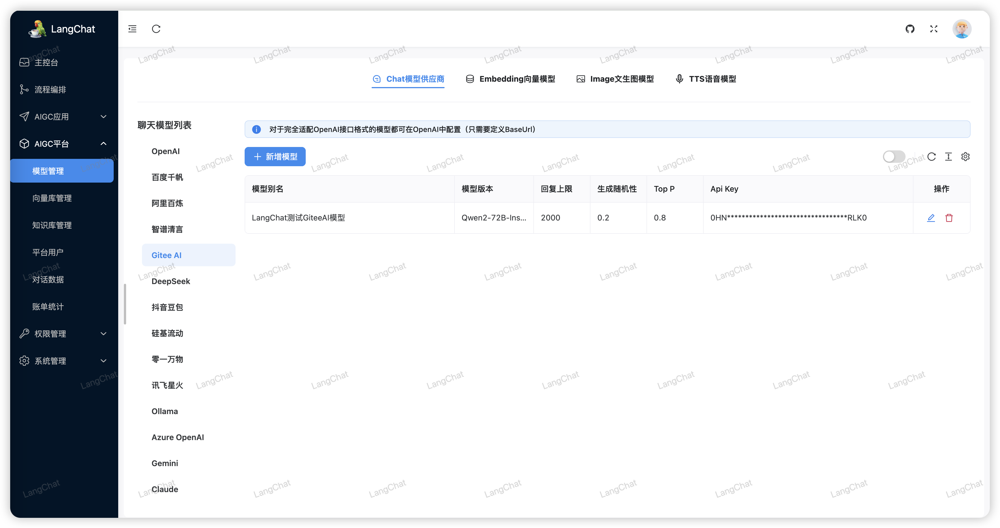
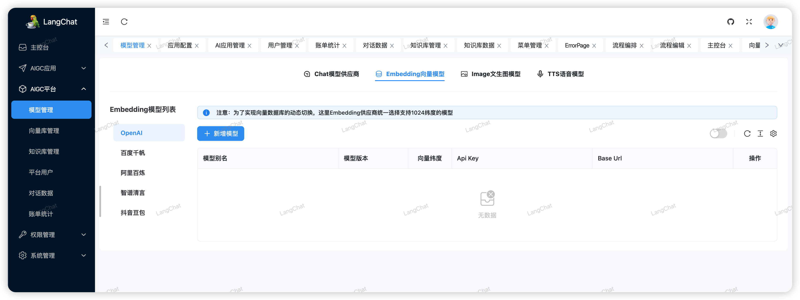
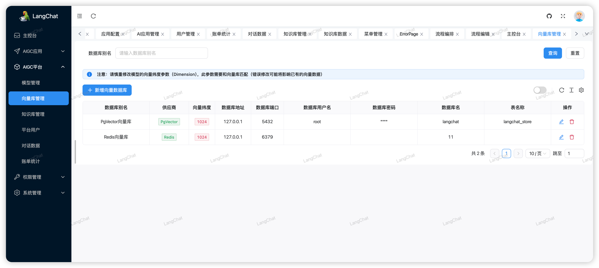
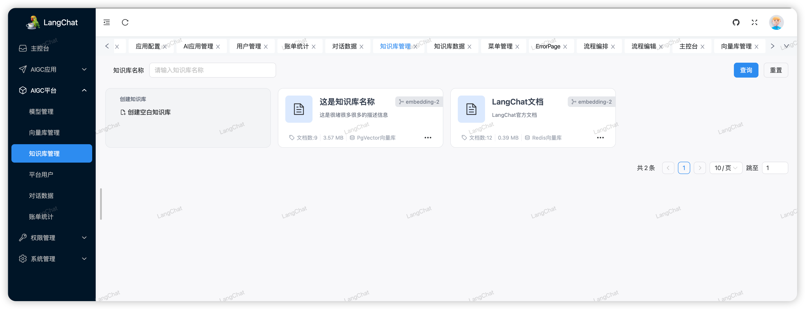
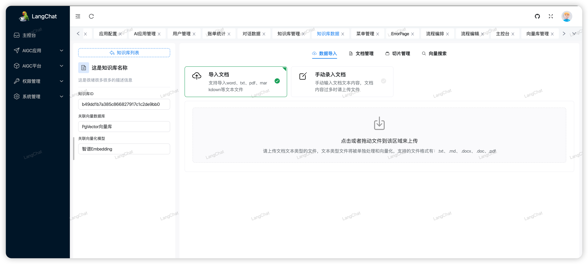
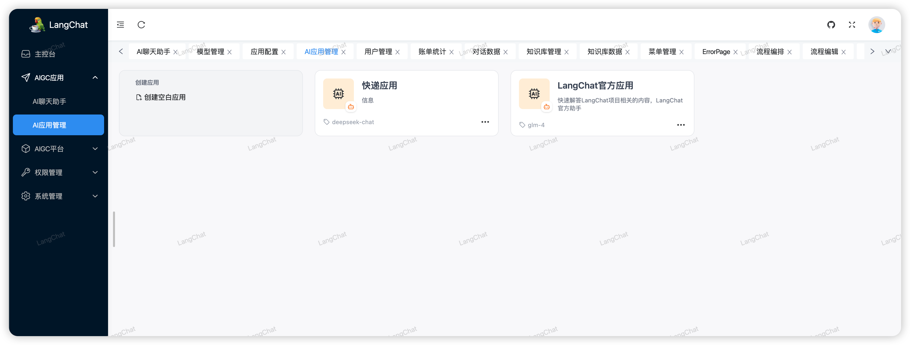
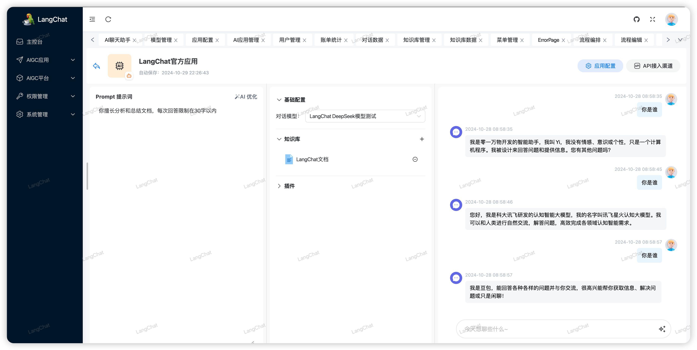
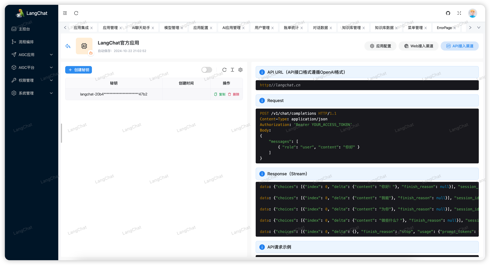
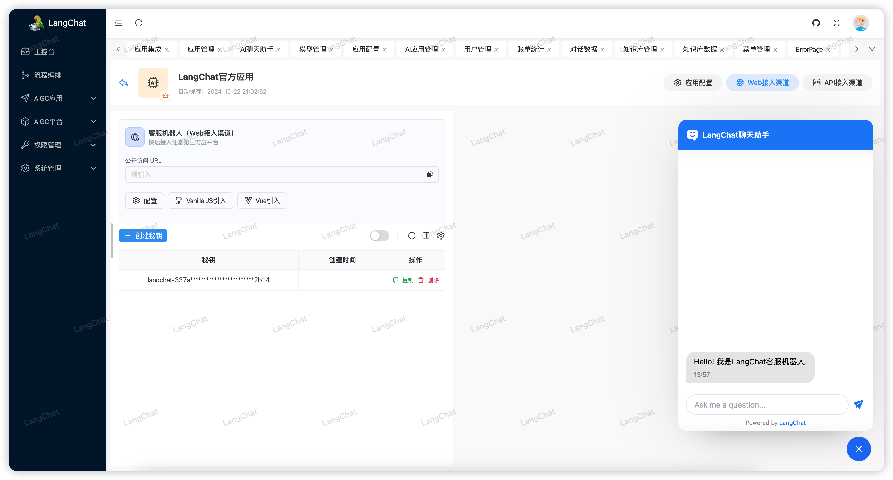

# LangChat

> 快速构建企业级AIGC项目

LangChat是Java生态下企业级AIGC项目解决方案，集成RBAC和AIGC大模型能力，帮助企业快速定制AI知识库、企业AI机器人。
 
**支持的AI大模型：** DeepSeek / Gitee AI / 阿里通义 / 百度千帆 / 抖音豆包 / 智谱清言 / 零一万物 / 讯飞星火 / OpenAI / Gemini / Ollama / Azure / Claude 等大模型。

- 产品官网：[http://langchat.cn/](http://langchat.cn/)
- 文档地址：[http://docs.langchat.cn/](http://docs.langchat.cn/)

**开源地址：**

- Gitee：https://gitee.com/langchat/langchat
- Github：https://github.com/tycoding/langchat
- GitCode: https://gitcode.com/LangChat/LangChat

**开源不易，欢迎Star、fork 持续关注**

## 商业化支持

LangChat Pro商业版：[https://langchat.cn/introduce](https://langchat.cn/introduce)

商务咨询：LangChainChat（备注公司名称）

## 赞助

微信：LangChainChat（备注：赞助）

## 版权和协议

Licensed under the Apache License 2.0. 

Copyright (c) 2025-present, LangChat Team.

## Star History

## 预览

## 感谢

- [LangChain4j](https://github.com/langchain4j/langchain4j)

## 联系

- 博客: https://tycoding.cn
- Github: https://github.com/tycoding
- 邮箱: langchat@outlook.com
