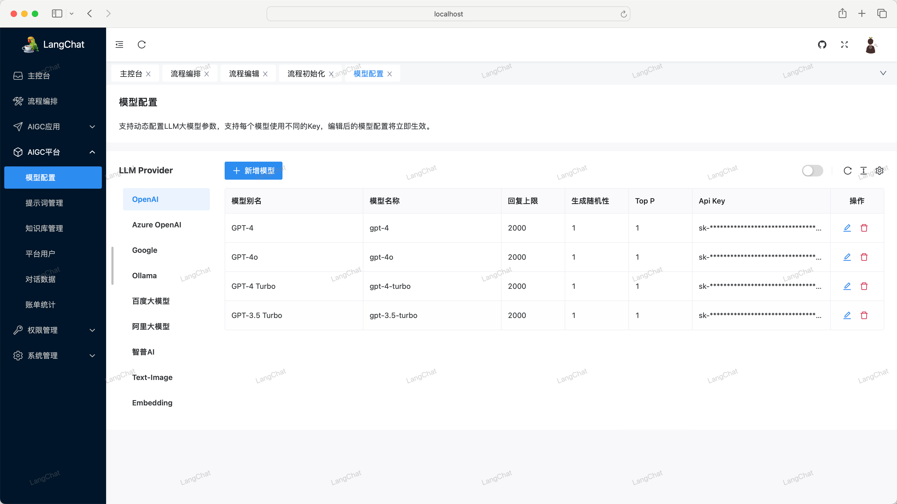
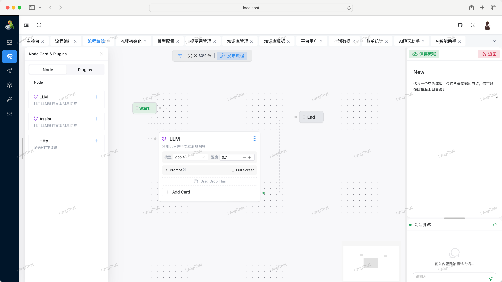
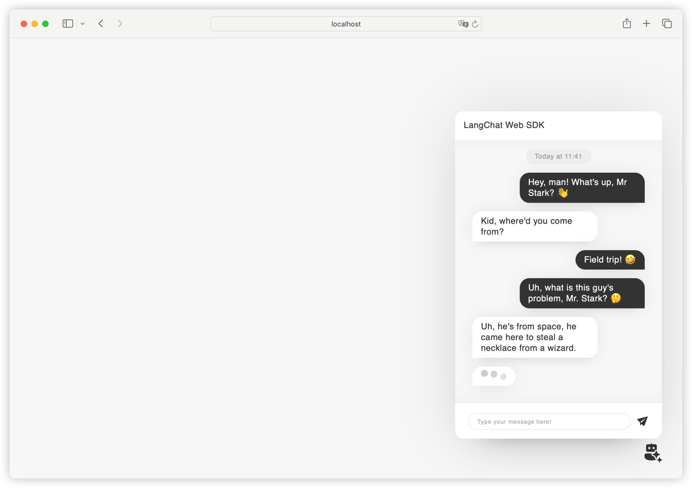

# LangChat

> 快速构建企业级AIGC项目

LangChat是Java生态下企业级AIGC项目解决方案，在RBAC权限体系的基础上，集成AIGC大模型能力，帮助企业快速定制AI知识库、企业AI机器人。
 
接入 OpenAI / Gemini / Ollama / Azure / 智谱 / 阿里通义大模型 / 百度千帆大模型等大模型。

**本项目前后端完全由TyCoding一个人开发，工作量庞大，可能存在一些问题请谅解，持续开发中...**

[English](./README_en.md)

- 网站文档：[http://langchat.cn/](http://langchat.cn/)
- 后台地址：[http://backend.langchat.cn/](http://backend.langchat.cn/)
- 前台地址：[http://front.langchat.cn/](http://front.langchat.cn/)
- LangChat源码：[https://github.com/tycoding/langchat](https://github.com/tycoding/langchat)
- LangChat.cn源码：[https://github.com/tycoding/langchat.cn](https://github.com/tycoding/langchat.cn)

**注意：** 本项目仍有不完善和待开发的功能请见谅。如果你想深入和作者聊LangChat开发计划，**可以请作者喝一杯咖啡加入LangChat交流群**

**注意：** 由于贫穷，作者使用的最低配的阿里云服务器，所以访问速度会慢一些请谅解

**欢迎Star、fork 持续关注**

**LangChat部署、启动文档地址：** [http://www.langchat.cn/docs/introduction](http://www.langchat.cn/docs/introduction)

## 特性

1. 多模态：支持集成国内外数十家AI大模型
2. 动态配置：支持再页面上可视化动态配置大模型参数、Key等信息，无感刷新、无需每次重启服务
3. 知识库：支持向量化知识库文档，定制化Prompt对话场景
4. 高级RAG：支持Embedding模型，从知识库中精确搜索；集成Web Search等RAG插件
5. Function Call：支持定制化Tool工具类，实现本地函数调用，从第三方加载数据并提供给LLM
6. 多渠道发布：计划封装Web SDK，将AI智能客服快速嵌入任意第三方Web应用中；计划支持微信、飞书、钉钉等消息通信渠道（待完善）
7. Workflows：计划开发可视化LLM流程设计器，高自定义机器人执行流程（待完善）
8. 提供AIGC客户端应用，快速管理客户端数据
9. 更多特性...

## 赞助

由于作者精力有限，开发文档会有所欠缺，**可以加入我的Java微信交流群：LangChainChat（备注：闲聊）**。如果有Java全栈、NextJS全栈、二开、接单、项目合作也欢迎联系我。

如果你有关于LangChat的开发问题或者二开定制等需求，或者想要深入交流Java生态AIGC产品开发、产品变现等，也可以请作者喝一杯咖啡加入我的LangChat交流群（可以一起交流LangChat后续开发规划）：

添加微信：LangChainChat（备注：赞助）

## 版权和协议

Licensed under the GNU License (GPL) v3. 

Copyright (c) 2024-present, TyCoding.

采用GUN GPL-v3开源协议，可以免费学习使用，个人可以免费是接入使用，商业应用请联系作者授权。

## 版本更新

- 2024.7.15 LangChat正式发布、公开仓库
- 2024.7.19 LangChat完成分离Server、Client端业务架构，保持业务分离
- 2024.7.21 LangChat完成多存储方案，支持本地、七牛云、阿里云、腾讯云OSS服务
- 2024.7.30 LangChat开发Web SDK，接入API、WEB消息渠道，支持Iframe嵌入
- ...

## Star History

## 预览

## 感谢

- [LangChain4j](https://github.com/langchain4j/langchain4j)

## 联系

- 博客: https://tycoding.cn
- Github: https://github.com/tycoding
- 邮箱: langchat@outlook.com
