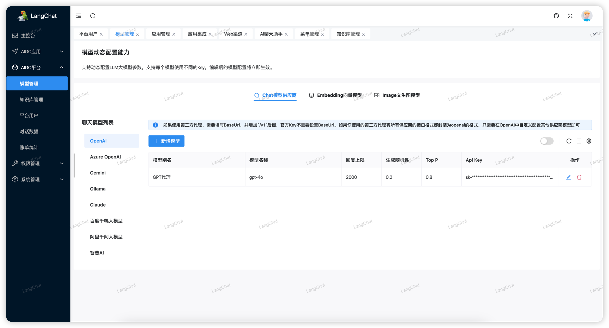
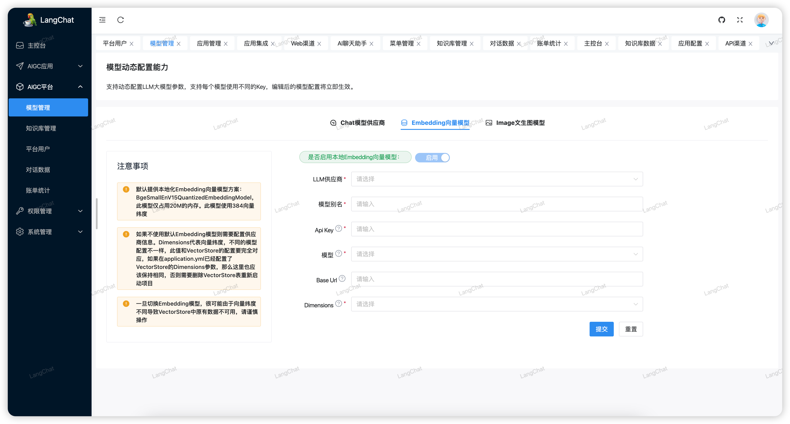
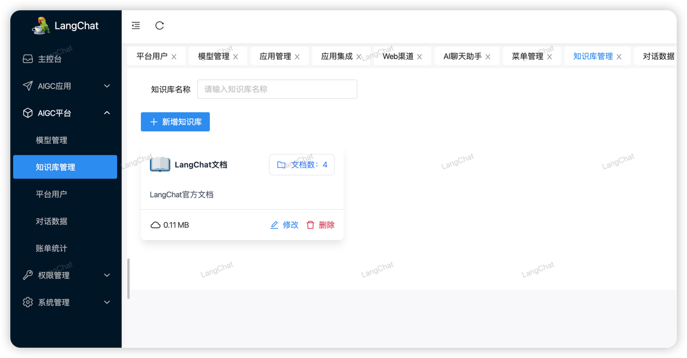
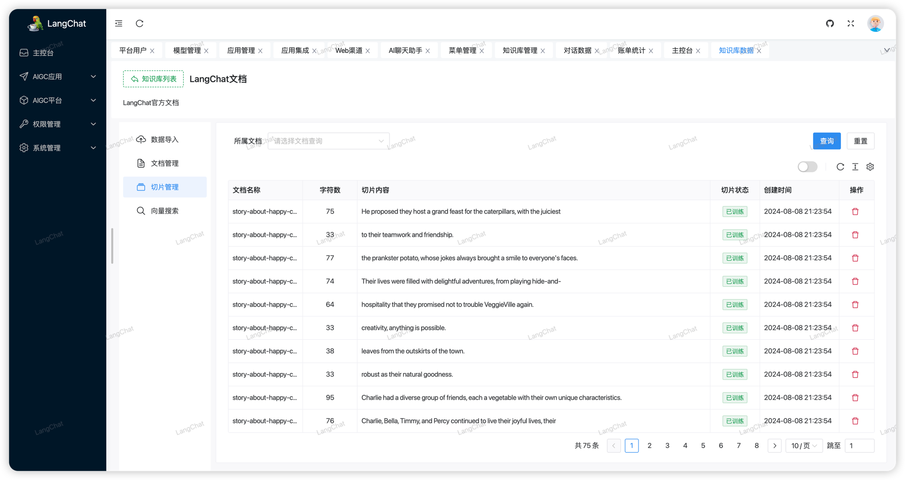
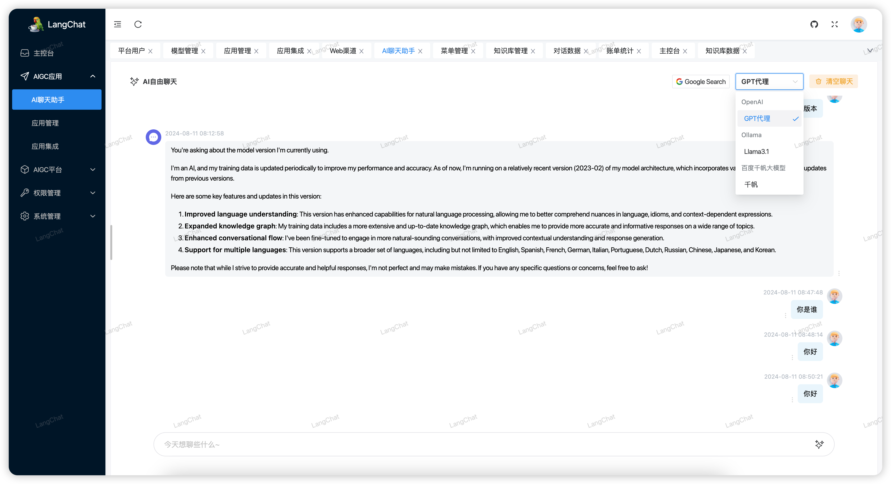
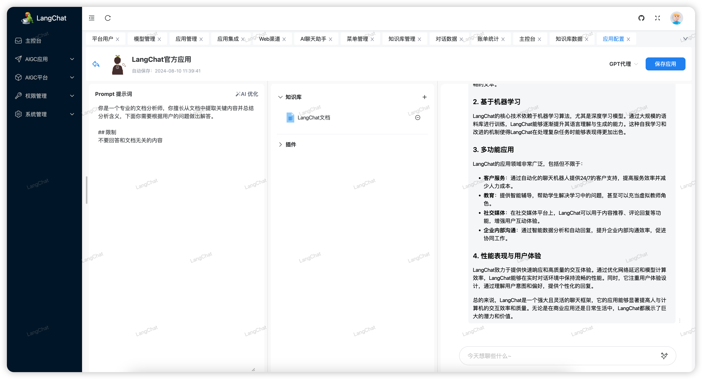
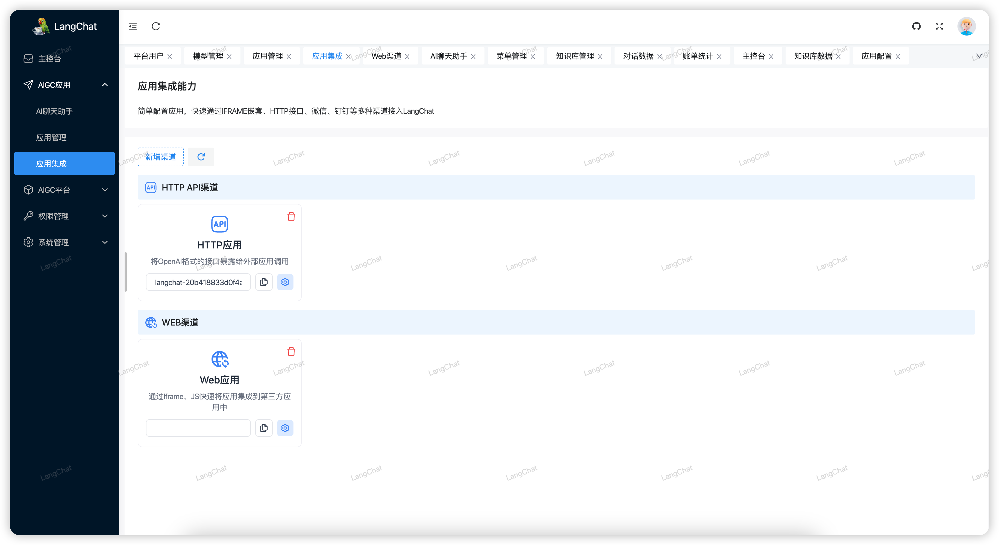
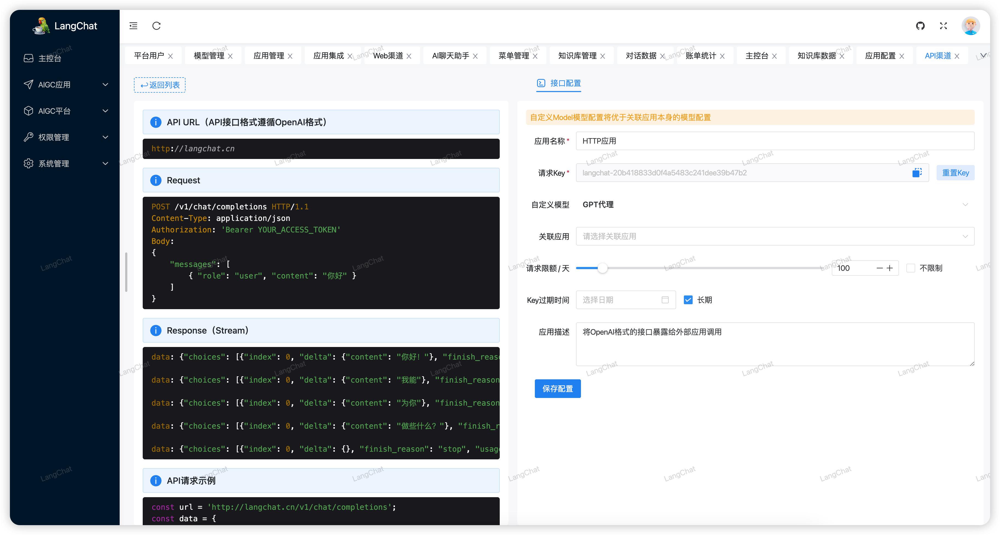
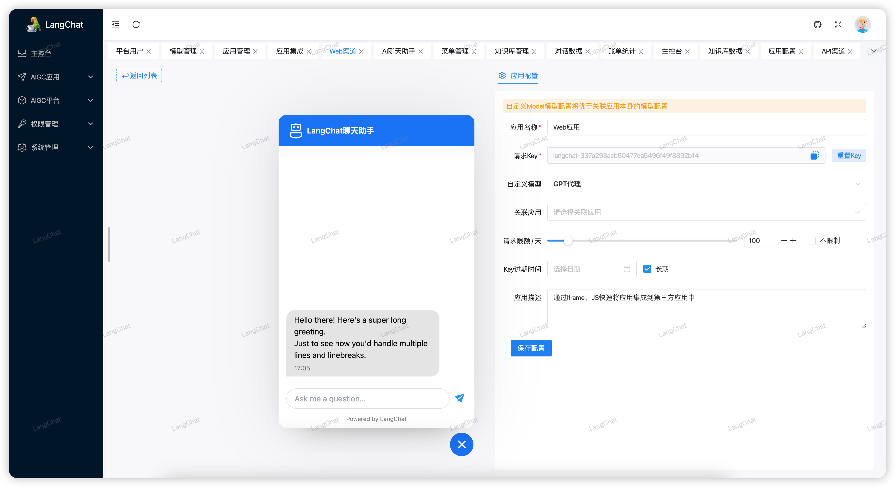

# LangChat

> Quickly Build Enterprise-level AIGC Projects

LangChat is an enterprise-level AIGC project solution in the Java ecosystem. Based on the RBAC permission system, it integrates AIGC large model functionalities to help enterprises quickly customize knowledge bases and enterprise robots.

[中文](./README.md)

- Website Docs：[http://langchat.cn/](http://langchat.cn/)
- Backend Preview：[http://backend.langchat.cn/](http://backend.langchat.cn/)
- Front Preview：[http://front.langchat.cn/](http://front.langchat.cn/)
- LangChat Source：[https://github.com/tycoding/langchat](https://github.com/tycoding/langchat)
- LangChat.cn Source：[https://github.com/tycoding/langchat.cn](https://github.com/tycoding/langchat.cn)

**Note:** LangChat is still under continuous development and may have some bugs and imperfections. The author will fix them as soon as possible.

**Welcome Star, fork to continue to pay attention**

 

## Features

1. Multimodal: Supports integration with dozens of AI large models from both domestic and international sources.
2. Dynamic Configuration: Allows visual dynamic configuration of large model parameters, keys, etc. on the page, with seamless refresh and no need to restart the service each time.
3. Knowledge Base: Supports vectorized knowledge base documents and customized Prompt dialogue scenarios.
4. Advanced RAG: Supports embedding models for precise searches within the knowledge base; integrates RAG plugins like Web Search.
5. Function Call: Supports customized tool classes for local function calls, loading data from third parties, and providing them to LLM.
6. Multi-channel Release: Plans to encapsulate a Web SDK to quickly embed AI smart customer service into any third-party web application; plans to support messaging channels such as WeChat, Feishu, DingTalk, etc. (to be improved).
7. Workflows: Plans to develop a visual LLM process designer for highly customized robot execution processes (to be improved).
8. Provides AIGC client applications to quickly manage client data
9. More features...

## Copyright and License

Licensed under the GNU License (GPL) v3. 

Copyright (c) 2024-present, TyCoding.

Support personal free access to learn to use, commercial applications please contact the author authorization

## Preview

## Thanks

- [LangChain4j](https://github.com/langchain4j/langchain4j)

## Contact

- Blog: https://tycoding.cn
- Github: https://github.com/tycoding
- Email: langchat@outlook.com
- WeChat: LangChainChat